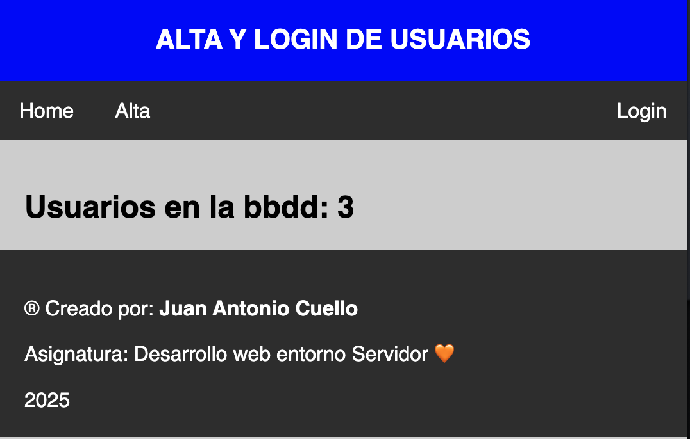
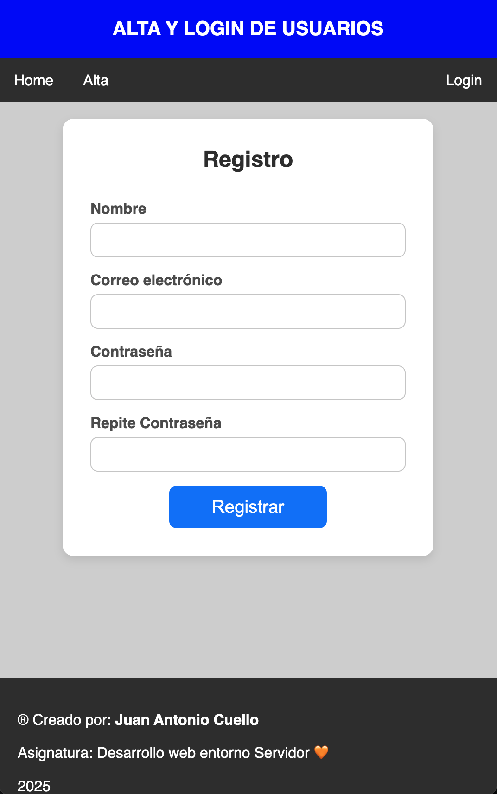
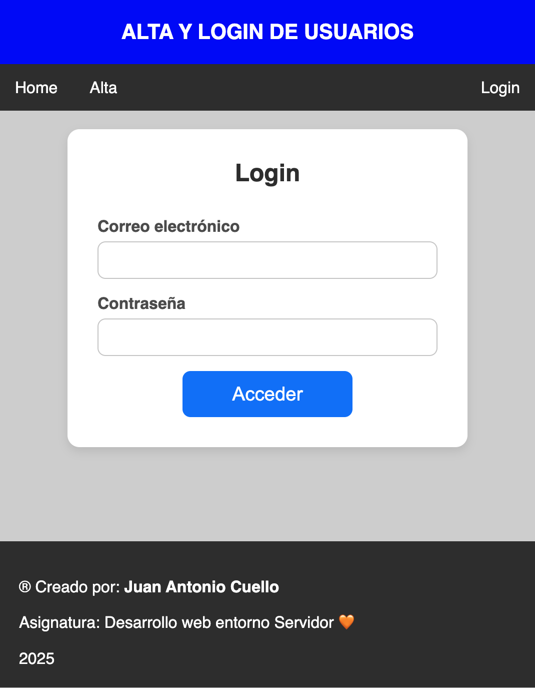
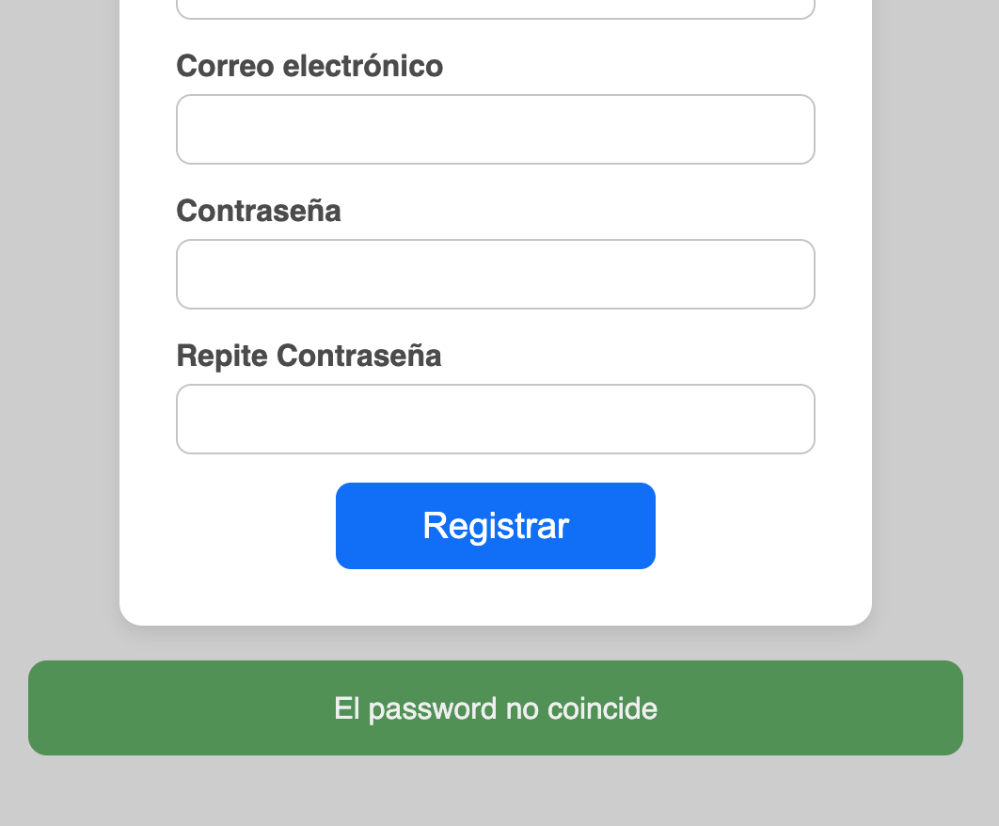

# FORMULARIO 5

## Alta y Login de usuarios (sin sesiones)
Hacer una aplicación para dar de alta a usuarios y para poder loguearse con dichos usuarios. Necesitaras nombre, email y password de cada usuario. Los datos se guardaran en un archivo `data.json` en formato json. Para loguearnos, usaremos un email y el password. 

El header, menu y el footer de las vistas se definirá en un archivo independiente (puedes agrupar header y menú) y se incluiran con `include "archivo"`

Los datos de las vistas (alta y login) se validarán en otro archivo del backend `procesar_alta.php` y `procesar_login.php`. Usaras `header(...)` para volver a la vista y pasar un mensaje (se hace por GET).

```php
$mensaje = "Credenciales inválidas";
header("Location: login.php?mensaje=$mensaje");
```

Usaras una clase `Usuario` para manejar los diferentes usuarios que se dan de alta. Necesitaras nombre, email y password de cada usuario. El password se guardará cifrado usando `password_hash($password, PASSWORD_DEFAULT);` para cifrarlo y `password_verify($password, $password_cifrado)` para verificarlo. 

Crearas las siguientes funciones:
- **checkuser($email, $password)**: comprueba credenciales. Devuelve false o el objeto usuario.
- **recoge($var)**: para recoger valores del formulario y depurarlos. Se proporciona. Devuelve el valor del campo sanitizado o null si está vacio.
- **existeUsuario($mail)**: para comprobar que un mail no se ha dado ya de alta.


## Vistas de la app

<br><br>

<br><br>

<br><br>


